# Complete Diagram Repository - All PlantUML & Mermaid Diagrams

## 1. HIGH-LEVEL ARCHITECTURE - PlantUML

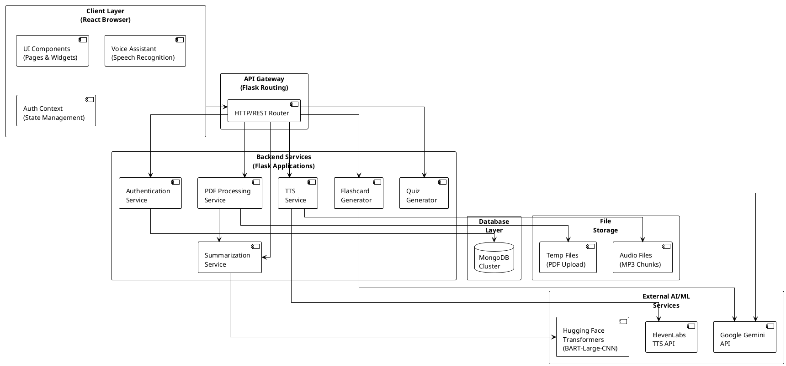

## 2. FRONTEND COMPONENT HIERARCHY - PlantUML

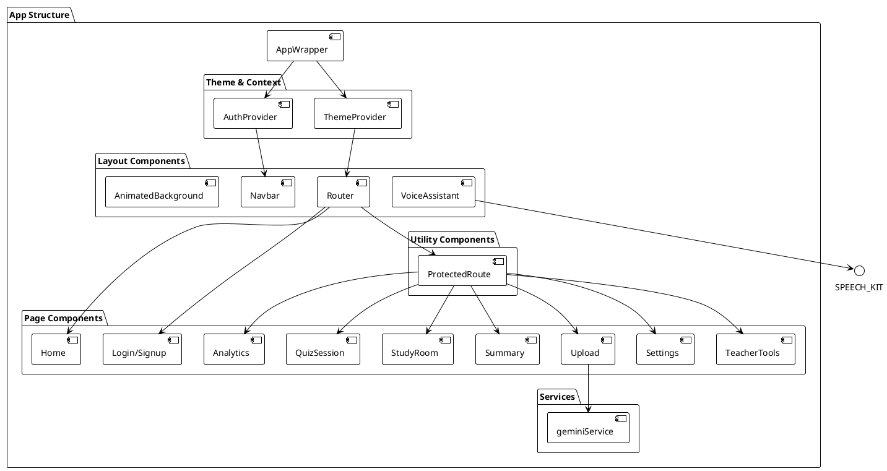

## 3. BACKEND SERVICE ARCHITECTURE - PlantUML

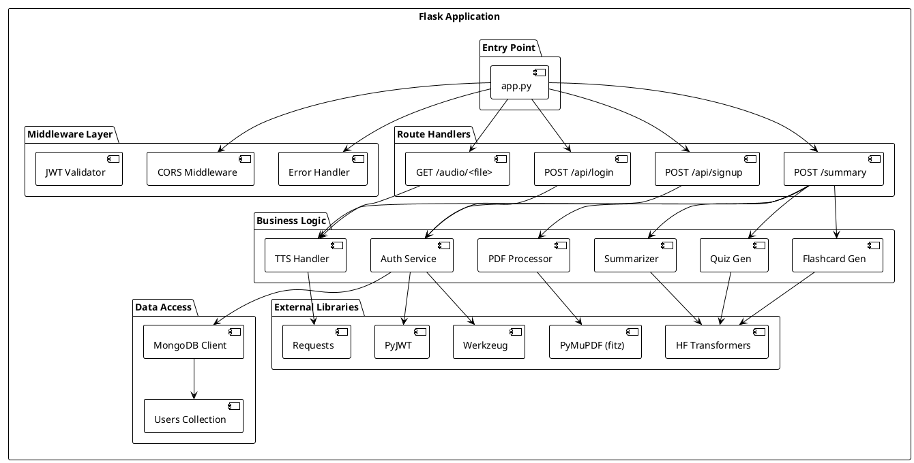

## 4. DATABASE ENTITY RELATIONSHIP - PlantUML

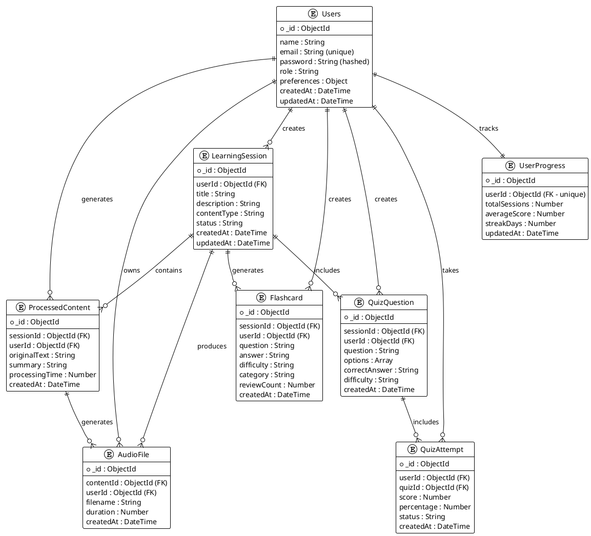

## 5. USER JOURNEY FLOW - Mermaid

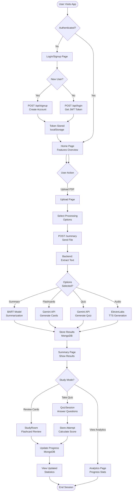

## 6. DATA PROCESSING PIPELINE - Mermaid

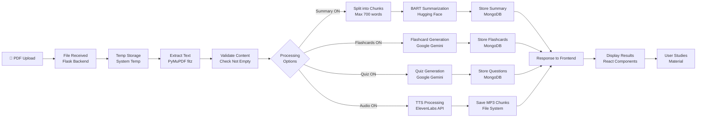

## 7. AUTHENTICATION & SECURITY FLOW - Mermaid

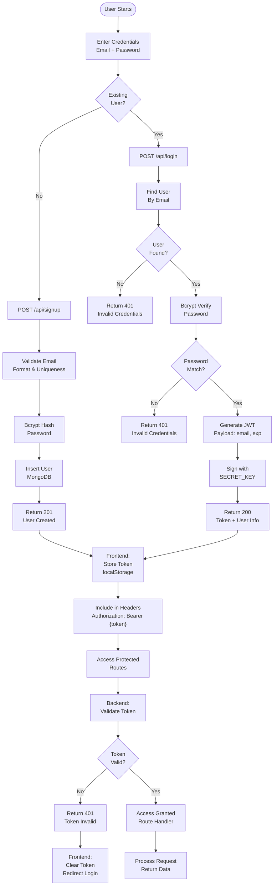

## 8. SYSTEM SEQUENCE DIAGRAM - Mermaid

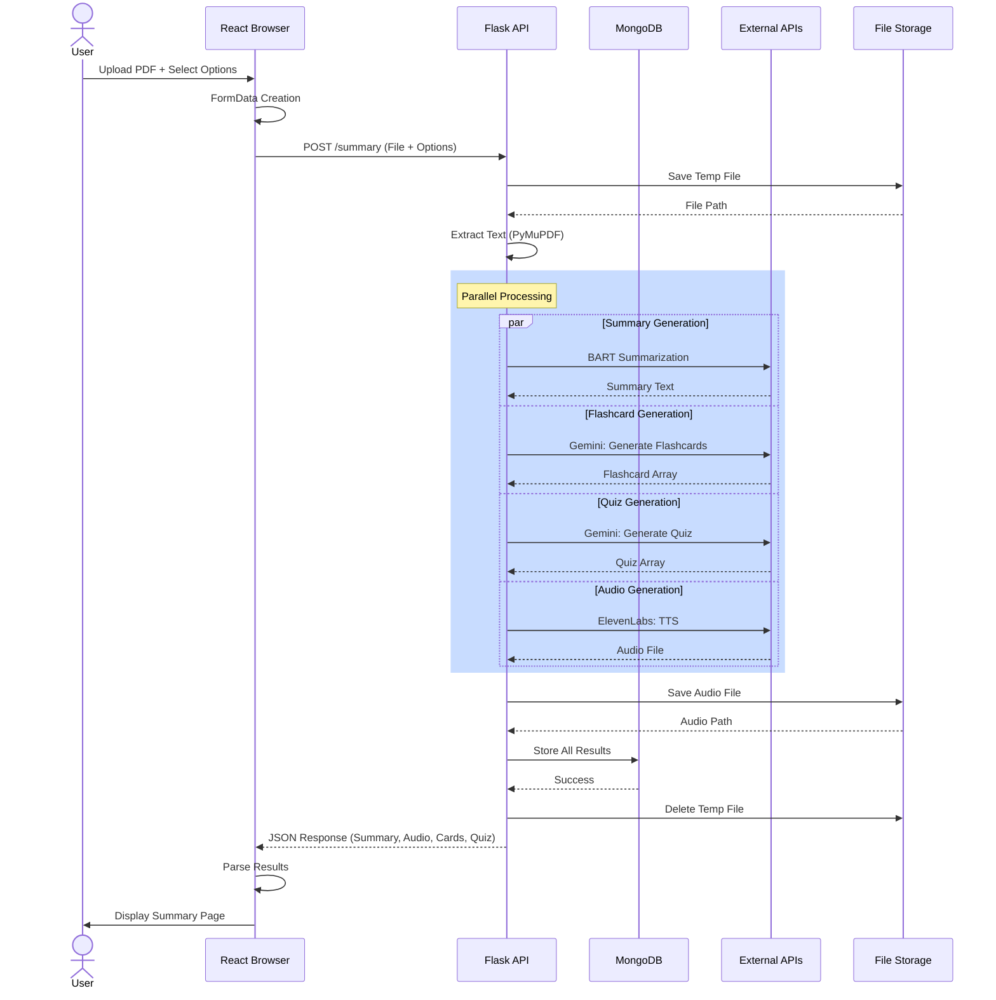

## 9. DEPLOYMENT ARCHITECTURE - Mermaid

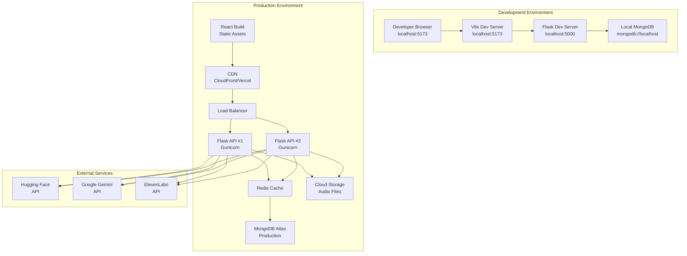

## 10. ERROR HANDLING FLOW - Mermaid

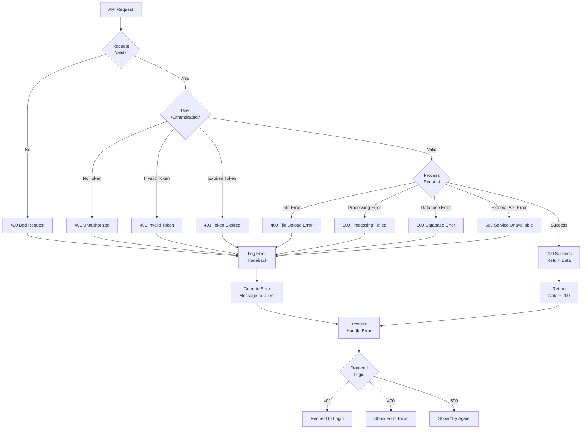

## 11. MERMAID - Complete Architecture

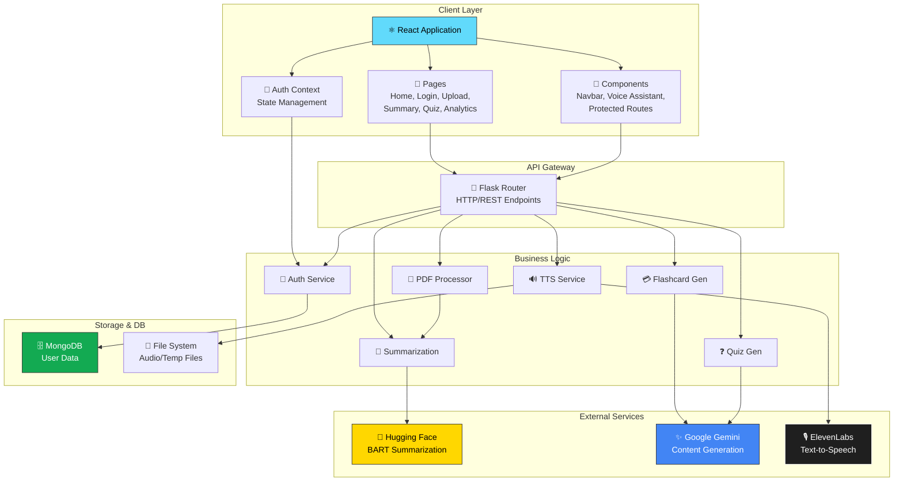

---

## Usage Instructions

### Viewing PlantUML Diagrams
1. Copy the PlantUML code into http://www.plantuml.com/plantuml/uml/
2. Or use VS Code extension: "PlantUML"
3. Or integrate with Draw.io or Miro for team collaboration

### Viewing Mermaid Diagrams
1. Copy code into https://mermaid.live/
2. Or use GitHub markdown (auto-renders)
3. Or use Mermaid VS Code extension

### Best Practices for Using These Diagrams
- Use HLD for high-level discussions with stakeholders
- Reference LLD for development and implementation
- Use ERD for database design and optimization discussions
- Share sequence diagrams during API integration meetings
- Use deployment diagrams for DevOps and infrastructure planning

---

## Diagram Legend

```
Colors:
- Green: Storage/Database
- Blue: Services/Processing
- Yellow: External Services
- Purple: User/Client
- Red: Errors/Warnings
- Orange: Files/Media

Symbols:
→  : Data Flow
←  : Response
↔  : Bidirectional
📄 : Document/File
🔐 : Security/Auth
🔧 : Tools/Components
⚙️  : Configuration
```

---

