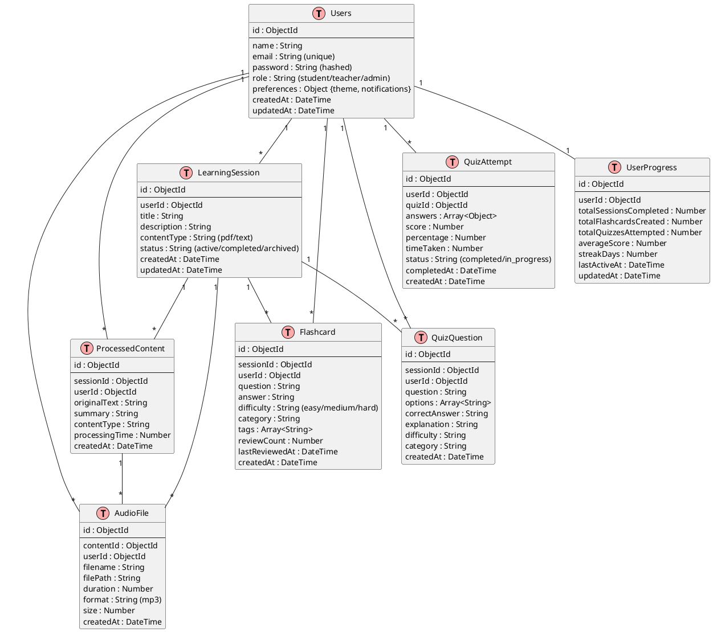
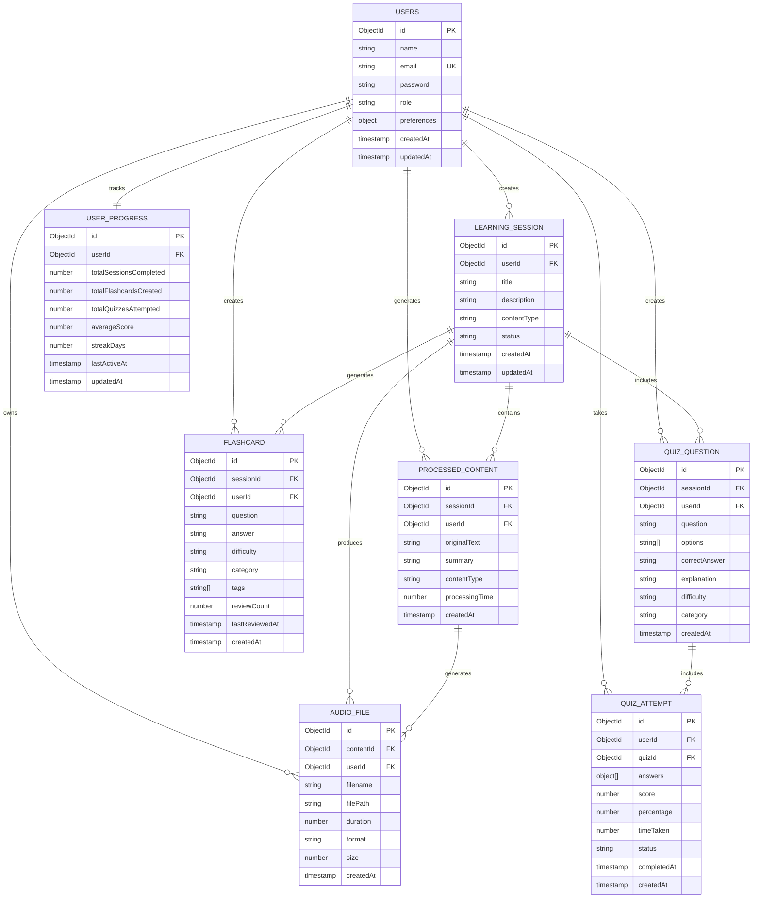

# Entity Relationship Diagram (ERD) - GW-ImpactAI Learning Platform

## Database Schema & Relationships

### ER Diagram (PlantUML)



## Mermaid ER Diagram



## Database Schema Details

### Users Collection

```json
{
  "_id": ObjectId,
  "name": "John Doe",
  "email": "john@example.com",
  "password": "$2b$12$...", // bcrypt hash
  "role": "student", // student | teacher | admin
  "preferences": {
    "theme": "dark", // light | dark | system
    "notifications": true,
    "language": "en"
  },
  "createdAt": ISODate("2024-01-15"),
  "updatedAt": ISODate("2024-01-15")
}
```

### LearningSession Collection

```json
{
  "_id": ObjectId,
  "userId": ObjectId,
  "title": "Biology Chapter 5",
  "description": "Study material for biology",
  "contentType": "pdf", // pdf | text | video
  "status": "active", // active | completed | archived
  "fileMetadata": {
    "originalFilename": "biology.pdf",
    "uploadedSize": 2048576,
    "pages": 45
  },
  "createdAt": ISODate("2024-01-15"),
  "updatedAt": ISODate("2024-01-16")
}
```

### ProcessedContent Collection

```json
{
  "_id": ObjectId,
  "sessionId": ObjectId,
  "userId": ObjectId,
  "originalText": "Full extracted text...",
  "summary": "Condensed summary...",
  "contentType": "pdf",
  "processingTime": 4200, // milliseconds
  "metadata": {
    "wordCount": 5000,
    "summaryWordCount": 500,
    "extractionMethod": "PyMuPDF"
  },
  "createdAt": ISODate("2024-01-15")
}
```

### Flashcard Collection

```json
{
  "_id": ObjectId,
  "sessionId": ObjectId,
  "userId": ObjectId,
  "question": "What is photosynthesis?",
  "answer": "Photosynthesis is the process by which plants convert light energy...",
  "difficulty": "medium", // easy | medium | hard
  "category": "Biology",
  "tags": ["photosynthesis", "biology", "plants"],
  "reviewCount": 5,
  "lastReviewedAt": ISODate("2024-01-16"),
  "createdAt": ISODate("2024-01-15")
}
```

### QuizQuestion Collection

```json
{
  "_id": ObjectId,
  "sessionId": ObjectId,
  "userId": ObjectId,
  "question": "Which organelle is responsible for energy production?",
  "options": [
    "Nucleus",
    "Mitochondria",
    "Ribosome",
    "Golgi Apparatus"
  ],
  "correctAnswer": "Mitochondria",
  "explanation": "Mitochondria is the powerhouse of the cell...",
  "difficulty": "easy",
  "category": "Cell Biology",
  "createdAt": ISODate("2024-01-15")
}
```

### QuizAttempt Collection

```json
{
  "_id": ObjectId,
  "userId": ObjectId,
  "quizId": ObjectId,
  "answers": [
    {
      "questionId": ObjectId,
      "selectedAnswer": "Mitochondria",
      "isCorrect": true,
      "timeTaken": 15000 // milliseconds
    }
  ],
  "score": 8,
  "totalQuestions": 10,
  "percentage": 80,
  "timeTaken": 450000, // milliseconds
  "status": "completed",
  "completedAt": ISODate("2024-01-16"),
  "createdAt": ISODate("2024-01-16")
}
```

### AudioFile Collection

```json
{
  "_id": ObjectId,
  "contentId": ObjectId,
  "userId": ObjectId,
  "filename": "summary_2024_01_15.mp3",
  "filePath": "/tts_chunks/summary_2024_01_15.mp3",
  "duration": 180000, // milliseconds
  "format": "mp3",
  "size": 2883840, // bytes
  "metadata": {
    "generator": "ElevenLabs",
    "voice": "neutral",
    "speed": 1.0
  },
  "createdAt": ISODate("2024-01-15")
}
```

### UserProgress Collection

```json
{
  "_id": ObjectId,
  "userId": ObjectId,
  "stats": {
    "totalSessionsCompleted": 15,
    "totalFlashcardsCreated": 342,
    "totalQuizzesAttempted": 28,
    "averageScore": 78.5,
    "bestScore": 95,
    "worstScore": 62
  },
  "engagement": {
    "streakDays": 7,
    "longestStreak": 14,
    "totalHoursLearned": 42.5
  },
  "lastActiveAt": ISODate("2024-01-16"),
  "updatedAt": ISODate("2024-01-16")
}
```

## Data Relationships

### One-to-Many Relationships

1. **Users → LearningSession**
   - One user can create multiple learning sessions
   - Foreign Key: `userId` in LearningSession

2. **Users → Flashcard**
   - One user can create multiple flashcards
   - Foreign Key: `userId` in Flashcard

3. **Users → QuizQuestion**
   - One user (or teacher) can create multiple quiz questions
   - Foreign Key: `userId` in QuizQuestion

4. **Users → QuizAttempt**
   - One user can take multiple quiz attempts
   - Foreign Key: `userId` in QuizAttempt

5. **LearningSession → ProcessedContent**
   - One session generates one processed content (1:1 in practice)
   - Foreign Key: `sessionId` in ProcessedContent

6. **LearningSession → Flashcard**
   - One session can have multiple flashcards
   - Foreign Key: `sessionId` in Flashcard

7. **LearningSession → QuizQuestion**
   - One session can have multiple quiz questions
   - Foreign Key: `sessionId` in QuizQuestion

### One-to-One Relationships

1. **Users ↔ UserProgress**
   - Each user has exactly one progress record
   - Foreign Key: `userId` in UserProgress

## Indexing Strategy

```javascript
// Users Collection
db.users.createIndex({ "email": 1 }, { unique: true })
db.users.createIndex({ "role": 1 })

// LearningSession Collection
db.learning_session.createIndex({ "userId": 1 })
db.learning_session.createIndex({ "status": 1 })
db.learning_session.createIndex({ "createdAt": -1 })

// ProcessedContent Collection
db.processed_content.createIndex({ "userId": 1 })
db.processed_content.createIndex({ "sessionId": 1 })
db.processed_content.createIndex({ "createdAt": -1 })

// Flashcard Collection
db.flashcard.createIndex({ "userId": 1 })
db.flashcard.createIndex({ "sessionId": 1 })
db.flashcard.createIndex({ "difficulty": 1 })
db.flashcard.createIndex({ "tags": 1 })

// QuizAttempt Collection
db.quiz_attempt.createIndex({ "userId": 1 })
db.quiz_attempt.createIndex({ "completedAt": -1 })
```

## Data Aggregation Pipeline Examples

### User Learning Statistics
```javascript
db.users.aggregate([
  {
    $lookup: {
      from: "learning_session",
      localField: "_id",
      foreignField: "userId",
      as: "sessions"
    }
  },
  {
    $lookup: {
      from: "quiz_attempt",
      localField: "_id",
      foreignField: "userId",
      as: "attempts"
    }
  },
  {
    $project: {
      name: 1,
      email: 1,
      totalSessions: { $size: "$sessions" },
      totalQuizAttempts: { $size: "$attempts" },
      averageScore: { $avg: "$attempts.percentage" }
    }
  }
])
```

## Data Validation Rules

| Collection | Field | Validation |
|-----------|-------|-----------|
| Users | email | Required, Unique, Valid email format |
| Users | password | Required, Min 8 chars, hashed |
| Flashcard | question | Required, Max 500 chars |
| Flashcard | answer | Required, Max 2000 chars |
| QuizQuestion | options | Required, Exactly 4 options |
| QuizAttempt | percentage | 0-100 numeric range |
| AudioFile | duration | Positive integer, milliseconds |

## Backup & Recovery Strategy

1. **Backup Frequency**: Daily automated backups
2. **Retention**: Keep 30 days of daily backups
3. **Recovery Time Objective (RTO)**: 2 hours
4. **Recovery Point Objective (RPO)**: 1 hour
5. **Backup Location**: Cloud storage with geo-replication
