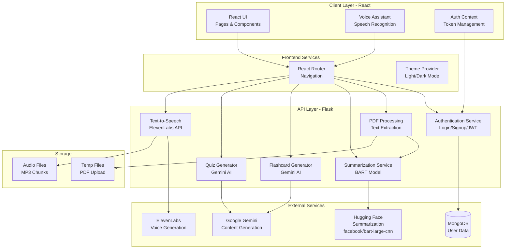

# High-Level Design (HLD) - GW-ImpactAI Learning Platform

## System Overview

The GW-ImpactAI Learning Platform is an AI-powered educational system designed to help users learn effectively through intelligent content processing, interactive tools, and voice-assisted learning.

## Architecture Diagram (PlantUML)

```plantuml
@startuml HLD_Architecture
!define AWSPUML https://raw.githubusercontent.com/awslabs/aws-icons-for-plantuml/v14.0/dist
!include AWSPUML/AWSCommon.puml

actor User

package "Client Layer (React)" {
  component "Browser UI" as UI
  component "Voice Assistant" as VA
  component "Auth Context" as AC
}

package "API Gateway" {
  component "Router" as ROUTER
}

package "Backend Services (Flask)" {
  component "Authentication Service" as AUTH
  component "PDF Processing Service" as PDF_PROC
  component "Summarization Service" as SUMM
  component "Flashcard Generator" as FLASH
  component "Quiz Generator" as QUIZ
  component "TTS Service" as TTS
}

package "External Services" {
  component "MongoDB" as DB
  component "Hugging Face (Summarization)" as HF
  component "ElevenLabs (TTS)" as ELEVEN
  component "Google Gemini AI" as GEMINI
}

package "Storage" {
  component "Audio Files" as AUDIO
  component "TTS Chunks" as CHUNKS
}

User --> UI
UI --> ROUTER
VA --> ROUTER

ROUTER --> AUTH
ROUTER --> PDF_PROC
ROUTER --> SUMM
ROUTER --> FLASH
ROUTER --> QUIZ
ROUTER --> TTS

AUTH --> DB
PDF_PROC --> SUMM
SUMM --> HF
FLASH --> GEMINI
QUIZ --> GEMINI
TTS --> ELEVEN
TTS --> AUDIO
TTS --> CHUNKS

@enduml
```

## Mermaid Architecture Diagram



## Key Components

### 1. **Client Layer (React)**
- **Home Page**: Landing page with feature overview
- **Authentication Pages**: Login and Signup
- **Upload Page**: PDF file upload interface
- **Study Room**: Interactive learning environment
- **Quiz Session**: Quiz taking interface
- **Summary Page**: View summarized content
- **Analytics**: Learning analytics and progress
- **Teacher Tools**: Educational administration tools
- **Settings**: User preferences and configurations
- **Voice Assistant**: Always-available voice interaction

### 2. **API Gateway Layer (Flask)**
- **Authentication Endpoints**: User login, signup, token validation
- **PDF Processing Endpoints**: File upload and text extraction
- **Content Generation Endpoints**: Summarization, flashcards, quiz
- **Audio Serving Endpoints**: TTS audio file delivery

### 3. **Business Logic Services**
- **Authentication Service**: JWT-based auth with MongoDB
- **PDF Processing**: Extract text from uploaded PDFs using PyMuPDF
- **Summarization**: BART model for text summarization
- **Flashcard Generator**: AI-powered flashcard creation
- **Quiz Generator**: Intelligent quiz question generation
- **TTS Service**: Convert text to speech

### 4. **Data Layer**
- **MongoDB**: User profiles, credentials, preferences
- **File System**: Temporary PDFs, audio chunks

### 5. **External Integrations**
- **Hugging Face**: BART summarization model
- **Google Gemini**: Flashcard and quiz generation
- **ElevenLabs**: Professional text-to-speech

## Data Flow

### PDF Upload & Processing Flow
1. User uploads PDF from UI
2. Backend receives file and extracts text
3. Text is summarized using BART model
4. If requested, flashcards and quiz are generated using Gemini
5. If requested, summary is converted to speech via ElevenLabs
6. Results returned to frontend for display

### Authentication Flow
1. User enters credentials on Login/Signup
2. Backend validates and creates JWT token
3. Token stored in browser localStorage
4. Token included in Authorization header for protected routes
5. Backend validates token on each request

## Technology Stack

| Layer | Technology |
|-------|-----------|
| **Frontend** | React 18, Vite, TailwindCSS, Material-UI |
| **Backend** | Flask, Python 3.x |
| **Database** | MongoDB |
| **ML/AI** | Hugging Face Transformers, Google Gemini |
| **TTS** | ElevenLabs API |
| **PDF Processing** | PyMuPDF (fitz) |
| **Authentication** | JWT, bcrypt |
| **State Management** | React Context API |
| **Routing** | React Router v6 |

## Security Considerations

- JWT tokens with 24-hour expiration
- Password hashing using bcrypt
- CORS configuration for API access
- Protected routes with ProtectedRoute component
- API key management via environment variables
- File upload validation and temporary storage cleanup
