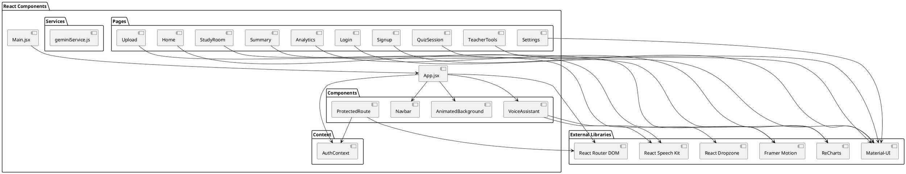
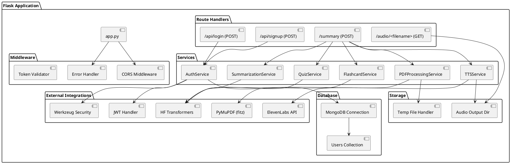

# Low-Level Design (LLD) - GW-ImpactAI Learning Platform

## System Architecture Overview

Detailed component-level design showing module interactions, data structures, and service APIs.

## Frontend Architecture (PlantUML)



## Backend Architecture (PlantUML)



## Data Models

### User Model (MongoDB)
```json
{
  "_id": ObjectId,
  "name": String,
  "email": String,
  "password": String (hashed),
  "createdAt": DateTime,
  "updatedAt": DateTime
}
```

### Flashcard Model
```json
{
  "id": String,
  "question": String,
  "answer": String,
  "difficulty": String (easy/medium/hard),
  "category": String
}
```

### Quiz Question Model
```json
{
  "id": String,
  "question": String,
  "options": [String, String, String, String],
  "correctAnswer": String,
  "explanation": String
}
```

## API Endpoints

### Authentication APIs

#### POST /api/signup
```json
Request:
{
  "name": "John Doe",
  "email": "john@example.com",
  "password": "secure_password"
}

Response:
{
  "message": "User created successfully"
}
```

#### POST /api/login
```json
Request:
{
  "email": "john@example.com",
  "password": "secure_password"
}

Response:
{
  "token": "jwt_token_here",
  "user": {
    "name": "John Doe",
    "email": "john@example.com"
  }
}
```

### Content Processing APIs

#### POST /summary
```json
Request:
{
  "file": File (PDF),
  "options": {
    "summary": Boolean,
    "audio": Boolean,
    "flashcards": Boolean,
    "quiz": Boolean
  }
}

Response:
{
  "summary": String,
  "audio_url": "/audio/filename.mp3",
  "flashcards": [Flashcard],
  "quiz": [QuizQuestion]
}
```

#### GET /audio/<filename>
Returns audio file for streaming

## Component Interactions

### PDF Upload Flow
```
User Upload → Upload Component → FormData (File + Options)
  ↓
API POST /summary
  ↓
Backend: File Received
  ↓
Extract Text (PyMuPDF)
  ↓
Summarize (BART)
  ↓
Generate Flashcards (Gemini)
  ↓
Generate Quiz (Gemini)
  ↓
Generate Audio (ElevenLabs)
  ↓
Response with all results
  ↓
Summary Component displays results
```

### Authentication Flow
```
User Input (Login/Signup)
  ↓
AuthContext.login() / AuthContext.signup()
  ↓
API POST /api/login or /api/signup
  ↓
Backend validates credentials / creates user
  ↓
Returns JWT token + user info
  ↓
Store token in localStorage
  ↓
Update AuthContext state
  ↓
Redirect to protected routes
```

## Frontend Component Hierarchy

```
AppWrapper
├── ThemeProvider
│   └── Router
│       └── AuthProvider
│           ├── Navbar
│           ├── VoiceAssistant
│           ├── AnimatedBackground
│           └── Routes
│               ├── Home
│               ├── Login
│               ├── Signup
│               ├── ProtectedRoute
│               │   ├── Upload
│               │   ├── Summary
│               │   ├── StudyRoom
│               │   ├── QuizSession
│               │   ├── Analytics
│               │   ├── TeacherTools
│               │   └── Settings
```

## Backend Service Details

### AuthService
- `signup(name, email, password)` → Creates user with hashed password
- `login(email, password)` → Validates credentials, returns JWT
- `validate_token(token)` → Validates JWT token

### PDFProcessingService
- `extract_text_from_pdf(file_path)` → Extracts text using PyMuPDF
- `split_into_chunks(text, max_words)` → Splits text into manageable chunks

### SummarizationService
- `summarize_large_text(text)` → Uses BART for summarization
- Handles chunking for large texts

### FlashcardService
- `generate_flashcards(text, max_flashcards)` → Generates flashcards using Gemini

### QuizService
- `generate_quiz(text, num_questions)` → Generates quiz questions using Gemini

### TTSService
- `generate_speech(text)` → Converts text to speech via ElevenLabs
- Returns audio file path

## Error Handling

### Frontend
- Try-catch blocks for API calls
- User-friendly error messages
- Token refresh on 401 responses

### Backend
- Global error handler middleware
- Traceback logging
- Graceful degradation for failed services

## Performance Considerations

1. **PDF Processing**: Chunked text processing for large PDFs
2. **Model Inference**: Summarization limited to 700 words per chunk
3. **Caching**: Browser localStorage for auth tokens
4. **Lazy Loading**: Route-based code splitting in React
5. **Audio Streaming**: Chunked audio file serving

## Security Implementation

1. **Authentication**
   - JWT tokens with 24-hour expiration
   - Bcrypt password hashing
   - Secure token storage in localStorage

2. **API Security**
   - CORS configuration
   - Token validation on protected routes
   - Input validation

3. **File Handling**
   - Temporary file cleanup
   - File type validation
   - Path traversal prevention
